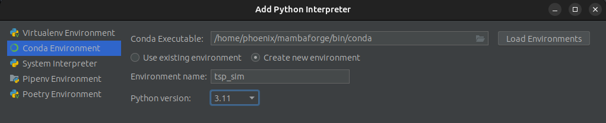
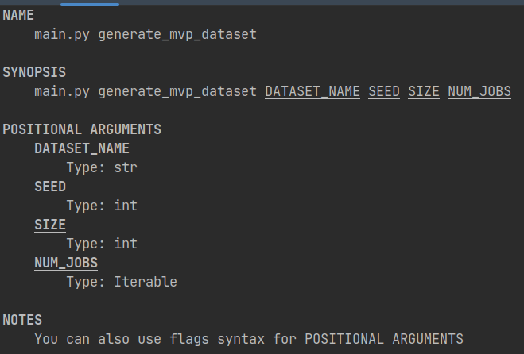
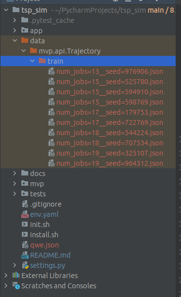

# tsp_sim

## Installation

- Install [miniforge](https://github.com/conda-forge/miniforge):

    ```shell
    curl -L -O "https://github.com/conda-forge/miniforge/releases/latest/download/Mambaforge-$(uname)-$(uname -m).sh"
    bash Mambaforge-$(uname)-$(uname -m).sh
    ```
- Create conda/mamba environment and activate it:
    - Manually:

      ```shell
      mamba create -n tsp_sim python=3.11
      mamba activate tsp_sim
      ```
    - OR using Pycharm interpreter settings:
      

- Install dependencies:

  ```shell
  ./init.sh --prune
  ```
- Have fun! 🥳💃🕺


## How to generate TSP dataset?

Type: `python -m mvp.main generate_mvp_dataset --help`



Example: 

`python -m mvp.main generate_mvp_dataset --dataset_name=train --seed=368 --size=10 --num_jobs=[10,20]`

or plain argument based

`python -m mvp.main generate_mvp_dataset train 368 10 [10,20]`

will create the following json dataset:




  